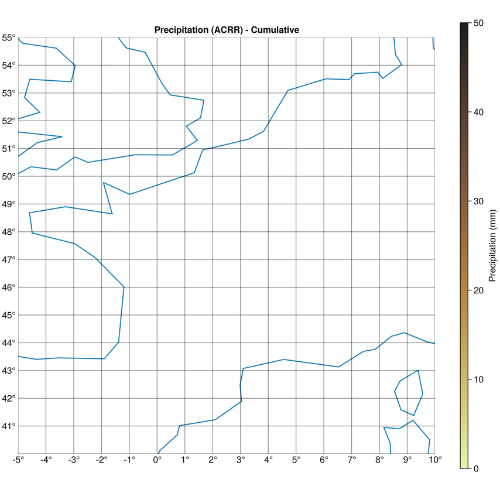

# Cloud Tracking in the Alpine Region using Météo-France Radar Data

This project utilizes precipitation radar imagery from Météo-France to detect and track cloud movements, with a specific focus on the **Alpine Region**. By applying advanced image processing and morphological operations in Julia, we identify and monitor precipitation areas as indirect indicators of cloud patterns and their dynamics.

---

## Dataset Overview

The core data source for this project is the **"Mosaïque de cumul 5min"** dataset from Météo-France, a composite product providing detailed 5-minute precipitation accumulation.

### Dataset Specifications

* **Product ID:** Mosaïque de cumul 5min
* **Description:** A composite representing 5-minute precipitation accumulation, derived from fusing individual radar images across the Météo-France network.
* **Geographical Scope:** While the dataset covers Metropolitan France, La Réunion, the Antilles, and New Caledonia, our analysis is specifically limited to the **Alpine Region within Metropolitan France**.
* **Format:** NETCDF, adhering to NetCDF Climate and Forecast (CF) Metadata Conventions (CF-1.7).
* **Variables:** Each NETCDF file contains two key parameters:
    * **QUALITY (Quality Code):** A dimensionless variable (0-100) indicating data quality. We will prioritize pixels with higher quality for analysis.
    * **ACRR (Water Equivalent):** Quantifies 5-minute precipitation accumulation in hundredths of millimeters (1/100 mm). This parameter is crucial for identifying precipitation areas.

### Data Acquisition

Météo-France radar data is accessible for download at: [https://radarsmf.aeris-data.fr/acces-donnees/](https://radarsmf.aeris-data.fr/acces-donnees/)

A comprehensive overview of the dataset is available at: [https://radarsmf.aeris-data.fr/description/?uuid=2ae37eb0-31fc-494d-b949-41d25ea37219](https://radarsmf.aeris-data.fr/description/?uuid=2ae37eb0-31fc-494d-b949-41d25ea37219)

### Additional Dataset Notes

* The reference date of a NETCDF file corresponds to the start time of its accumulation period.
* For accumulations exceeding 15 minutes, missing values (encoded as 65535) should be treated as 0 mm.
* The geometry of the mosaic grids is not perfectly rectangular when projected in EPSG:4326.

---

## Project Methodology

The project's workflow is implemented in Julia, leveraging specialized packages for image processing and data analysis.

### Workflow Outline

1.  **Data Ingestion and Spatial Subset Selection:**
    * Ingest NETCDF radar images using packages like `NCDatasets.jl` and `Rasters.jl` to extract the **ACRR** and **QUALITY** variables.
    * Spatially subset the data to focus exclusively on the **Alpine Region**.
    * Filter data using the **QUALITY** variable, retaining only sufficiently high-quality pixels.

2.  **Precipitation Detection (Binarization):**
    * Apply a threshold to the **ACRR** (accumulated precipitation) variable to create binary maps, identifying precipitation areas.
    * Perform pre-processing techniques like noise reduction or morphological filtering using `ImageFiltering.jl` and `ImageMorphology.jl` as needed.

3.  **Clustering of Precipitation Regions:**
    * Aggregate detected precipitation pixels on the binary map into discrete "cloud clusters" or precipitation cells.
    * Achieve this through morphological operations (e.g., connected components labeling from `ImageMorphology.jl`) or clustering algorithms (`Clustering.jl`).

4.  **Object Tracking:**
    * Implement a tracking methodology to monitor the spatiotemporal displacement of identified precipitation clusters across successive time steps. (Algorithms for this phase are currently under development.)

5.  **Visualization:**
    * Visualize results, including tracked cloud movements within the Alpine Region, using `Makie.jl` and `GeoMakie.jl`. These packages provide robust tools for scientific data visualization, including geographic projections, for clear and interactive presentation.

---

### Current Status: Data Loading and Initial Visualization

Currently, the data ingestion pipeline is robust. We can successfully load the NetCDF radar files, extract the `ACRR` (precipitation) and `QUALITY` data, and correctly interpret their associated Coordinate Reference System (CRS). The `Rasters.jl` framework is used to manage this geospatial data effectively.

A notable aspect of the data loading process is the necessity for a custom function (`load_netcdf_radar_data`) rather than directly using `Rasters.jl`'s built-in file loading. This complex, manual approach for extracting data and constructing the `RasterStack` is crucial because the **CRS (Coordinate Reference System) information is not consistently or explicitly stored in a format directly parseable by `Rasters.jl`'s default NetCDF readers for this specific dataset**. The `grid_mapping` variable and its attributes, which contain the Polar Stereographic projection parameters, must be manually read from the NetCDF file and assembled into a PROJ string. This ensures that the `Rasters.jl` objects (`Raster` and `RasterStack`) are instantiated with the correct spatial context, which is fundamental for accurate re-projection and analysis.

An example of a loaded `RasterStack`, `local_data_stack`, shows its dimensions, layers, and CRS information:

```julia
julia> local_data_stack
┌ 1536×1536×1 RasterStack ┐
├─────────────────────────┴─────────────────────────────────────────────────────────── dims ┐
  ↓ Y Projected{Int32} [-500, …, -1535500] ReverseOrdered Irregular Points,
  → X Projected{Int32} [500, …, 1535500] ForwardOrdered Irregular Points,
  ↗ Ti Sampled{DateTime} [DateTime("2025-06-02T18:25:00")] ForwardOrdered Irregular Points
├─────────────────────────────────────────────────────────────────────────────────── layers ┤
  :ACRR    eltype: Union{Missing, Int32} dims: Y, X, Ti size: 1536×1536×1
  :QUALITY eltype: Union{Missing, Int32} dims: Y, X, Ti size: 1536×1536×1
├─────────────────────────────────────────────────────────────────────────────────── raster ┤
  missingval: missing
  extent: Extent(Y = (-1535500, -500), X = (500, 1535500), Ti = (DateTime("2025-06-02T18:25:00"), DateTime("2025-06-02T18:25:00")))
  crs: +proj=stere +lat_0=90.0 +lon_0=0.0 +lat_ts=45.0 +x_0=619652.074055906 +y_0=3.5268...
└───────────────────────────────────────────────────────────────────────────────────────────┘
```

All the underlying components, including CRS parsing, data extraction, and raster object creation, are functioning as expected. However, the immediate challenge lies in the visualization phase: when attempting to plot the data, the geographical map and its features appear correctly, but the actual radar precipitation data itself does not render. This suggests that while the data is loaded and its CRS is understood, there might still be an issue with the data values, their range, or the final re-projection step that prevents them from being rendered as a visible heatmap layer on the map. Resolving this data rendering issue is now the primary focus and the next critical step for the project.

)

